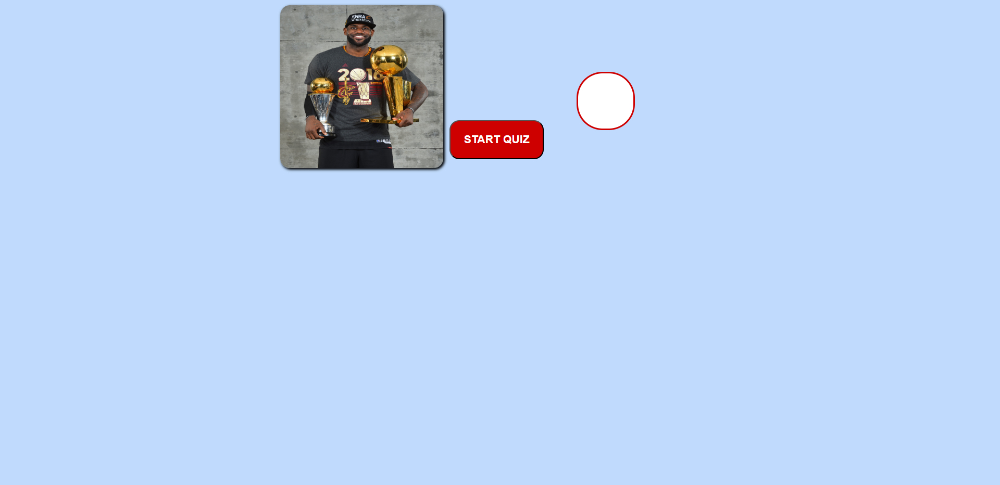
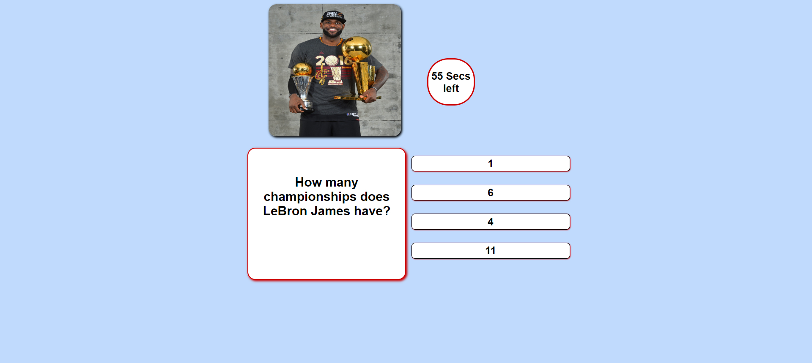
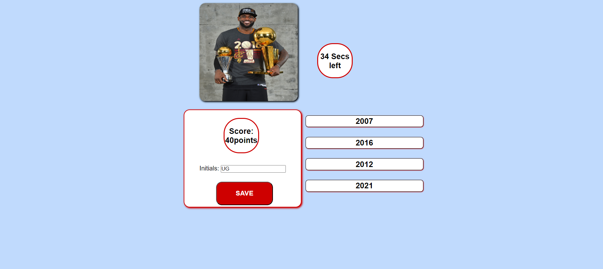
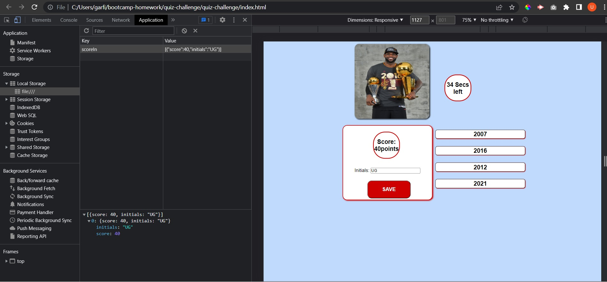

# quiz-challenge

## Description
This is a timed quiz about the career of the NBA player LeBron James, each question has a value of 20 points.
There are different ways to interact with a webpage using JavaScript, in this challenge I noticed the importance of navigating the DOM, how we can create elements, change elements content en even delete elements from an html file by just using JavaScript code. This is a good way to make a webpage more interactive for the user. 

## Usage
- Once page loads the user will be presented with a start button and timer, once the start button is clicked, questions and answers will be shown to the user. Timer will start at 60 seconds and counting down.

- When question is answered wrong, 5 seconds will be subtracted from timer and no points will be added.
- When the user answers all questions, score and initials input will be displayed.

- Initials and score will be added to the local storage.

## Credits
Img:https://www.facebook.com/nba/photos/a.90133653462/10159926631303463/?type=3

https://www.w3schools.com/

Tutor: Jose Lopez

## License
MIT License

Copyright (c) [2023] [Ulises-Garfias]

Permission is hereby granted, free of charge, to any person obtaining a copy
of this software and associated documentation files (the "Software"), to deal
in the Software without restriction, including without limitation the rights
to use, copy, modify, merge, publish, distribute, sublicense, and/or sell
copies of the Software, and to permit persons to whom the Software is
furnished to do so, subject to the following conditions:

The above copyright notice and this permission notice shall be included in all
copies or substantial portions of the Software.

THE SOFTWARE IS PROVIDED "AS IS", WITHOUT WARRANTY OF ANY KIND, EXPRESS OR
IMPLIED, INCLUDING BUT NOT LIMITED TO THE WARRANTIES OF MERCHANTABILITY,
FITNESS FOR A PARTICULAR PURPOSE AND NONINFRINGEMENT. IN NO EVENT SHALL THE
AUTHORS OR COPYRIGHT HOLDERS BE LIABLE FOR ANY CLAIM, DAMAGES OR OTHER
LIABILITY, WHETHER IN AN ACTION OF CONTRACT, TORT OR OTHERWISE, ARISING FROM,
OUT OF OR IN CONNECTION WITH THE SOFTWARE OR THE USE OR OTHER DEALINGS IN THE
SOFTWARE.
